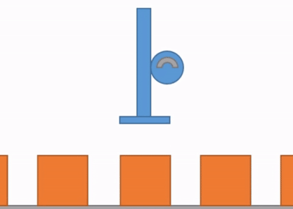
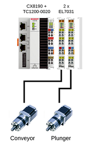
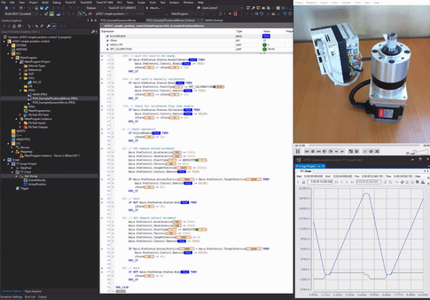
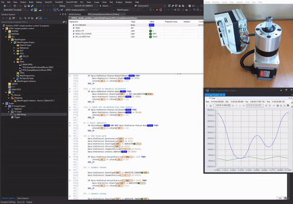
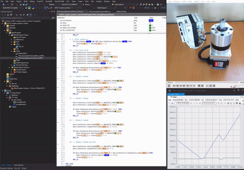

# Example EL7xxx range with Positioning Interface

## Disclaimer
This is a personal guide not a peer reviewed journal or a sponsored publication. We make
no representations as to accuracy, completeness, correctness, suitability, or validity of any
information and will not be liable for any errors, omissions, or delays in this information or any
losses injuries, or damages arising from its display or use. All information is provided on an as
is basis. It is the reader’s responsibility to verify their own facts.

The views and opinions expressed in this guide are those of the authors and do not
necessarily reflect the official policy or position of any other agency, organization, employer or
company. Assumptions made in the analysis are not reflective of the position of any entity
other than the author(s) and, since we are critically thinking human beings, these views are
always subject to change, revision, and rethinking at any time. Please do not hold us to them
in perpetuity.

## How to use the EL7xxx range with Positioning Interface. 
If you have never heard of the positioning interface it’s a special mode in the EL70x7 (and soon EL7xxx) modules that means the terminal does the path planning. This means no NC!

So a simple CX7xxx/CX80xx/CX81xx can run motion. (currently there is no NC license for them). You can directly connect PLC to the terminal and command a move.

It is possible to control multiple axis under position control with a very basic setup.  Please note that Gearing and Camming is not possible!  

## Overview

## Install 
Not required.  Simply open the project.

## TwinCAT
This project uses TcXaeShell 3.1.4024.7 and the following hardware.

* CX8190
* EL7031

## Videos

### High accel motion

### Low accel motion

### Dynamic motion

## Getting started
This is not a guide for TcXaeShell, please visit http://beckhoff.com/ for further guides
* Open the included TwinCAT project and activate on your local machine
* Login and set the PLC running

## Firmware
Early versions of the Firmware do not support dynamic changes to position.  This has been tested with an EL7031 with Firmware 13. 

[EL7031-0000-SW13.efw](docs/firmware/EL7031-0000-SW13.efw)

Contact Beckhoff for further firmware updates.